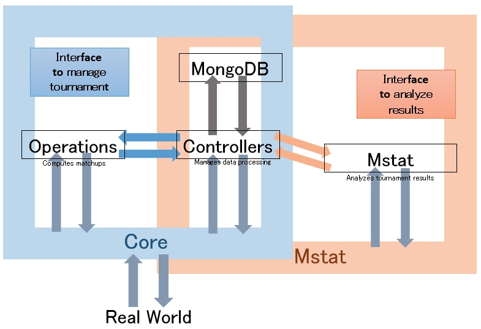

# UTab-core-js

Simpler and faster version of UTab-api in Node with DatabaseHandler embedded.

Designed to help UTab-view.

The original version of UTab-core in Python is [here](https://github.com/taulukointipalvelut/utab-api-server).

## Files

 + "CHANGELOG.md" - Release notes
 + "NEXT.md" - Concrete interface in the next version of UTab core js
 + "TERMS.md" - Terms
 + "INTERFACE.md" - Interfaces

## Documents

Documentation for version 1 is available at [here](https://taulukointipalvelut.github.io/)

## Usage

1. Clone this repository. `git clone https://github.com/taulukointipalvelut/utab-core-js`

1. Start MongoDB. `mongod`

1. Import core.js and create an instance.
```javascript
var core = require('./utab-core-js/core.js')
var testtournament = new core.Main('testtournament')
```

## Features

1. Strict validation for database

1. New Matching Algorithms derived from Gale Shapley Algorithm

## Attention

1. You should either set pre-evaluation to all adjudicators, or set preev to no adjudicators.

1. All return values from database functions are treated as Promise objects

1. Expected total round num is 1 ~ 6.

1. You should evaluate judge-pre-evaluation as same criteria as judge evaluation at the tournament.

1. Num of chairs must be odd.

1. ID, which is unique and constant in all entities throughout adjudicators/teams/debaters, of result sender should be specified when sending result.

## Code Names

**version 1.0** - Candle Light

**version 2.0** - Luna Flight

**version 3.0** - Frosty Night

## Future Coming

### UTab-core-js version 1.0 [Candle Light] (by 2016/11/20)

**To improve safety**

Planning to support

1. New matching algorithms
1. Database(MongoDB)
1. All basic functions

### UTab-core-js version 2.0 [Luna Flight] (by 2016/12?)

**To have more usability**

Planning to support

1. Simple backing up system
1. Improve Safety
1. Official backup support
1. Multiple chairs, panels, trainees

### UTab-core-js version 3.0 [Frosty Night] (in 2017)

**To improve internal algorithms**

Planning to support

1. Mstat

### UTab-core-js [future version] *

1. Modifying result after rounds

## ROLE OF EACH MODULE



 * core.js: tournament management interface
     * operations.js: data computing interface
         * allocations.js: functions to compute allocations
         * results.js: functions to summarize results
     * controllers.js: database management interface
         * database.js: databaase handler
         * schemas.js: document schema

```
core.js
    |
    |_src/operations.js
    |    |
    |    |_src/operations/allocations.js
    |    |    |_src/operations/sortings.js
    |    |    |_src/operations/matchings.js
    |    |    |_src/operations/sys.js
    |    |
    |    |_src/operations/results.js
    |    |    |_src/operations/sortings.js
    |    |    |_src/operations/math.js
    |    |    |_src/operations/sys.js
    |    |
    |    |_src/operations/adfilters.js
    |    |    |_src/operations/math.js
    |    |    |_src/operations/sys.js
    |    |
    |    |_src/operations/filters.js
    |         |_src/operations/math.js
    |         |_src/operations/sys.js
    |
    |_src/controllers.js
         |_src/controllers/database.js
         |_src/controllers/schemas.js
              |_src/controllers/schemas.js

```
